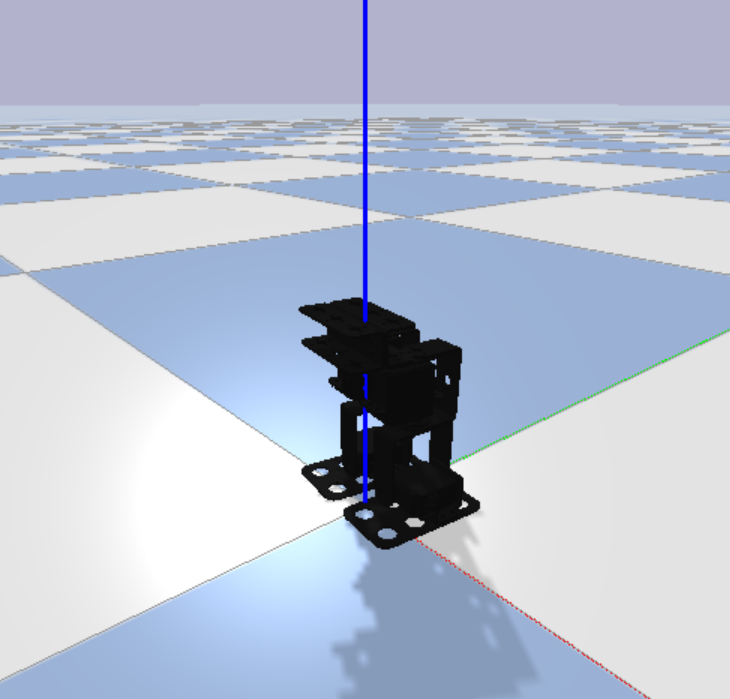

# 4-DOF Robot Walker URDF Simulation with PyBullet

## Description

Welcome to the 4-DOF Robot Walker URDF Simulation repository, where we explore the world of robotics simulation using URDF (Unified Robot Description Format) in conjunction with the powerful PyBullet physics engine. This project provides a comprehensive framework for modeling and simulating a 4-degree-of-freedom (4-DOF) robot walker, offering an immersive environment for testing and developing robotic control algorithms.

## Key Features

1. **URDF Model:** The repository includes a well-defined URDF model of a 4-DOF robot walker. The URDF format allows for a detailed description of the robot's kinematics, dynamics, and geometry, providing a realistic representation for simulation purposes.

2. **PyBullet Integration:** PyBullet, a physics engine designed for robotics and machine learning research, is seamlessly integrated into the project. Leveraging PyBullet's capabilities, users can simulate the robot's movements, interactions with the environment, and various control scenarios.

3. **Simulation Environment:** A customizable simulation environment is provided, allowing users to set up different scenarios and conditions for testing their control algorithms. The environment includes support for terrain variations, gravity adjustments, and external disturbances.

## Getting Started

1. **Clone the repository:** `git clone https://github.com/shepai/4dof-robot-walker-pybullet.git`
2. **Follow the setup instructions** in the documentation to install dependencies and set up the simulation environment.
3. **Explore the URDF model,** experiment with control algorithms, and customize the simulation for your specific needs.

## Contributions and Issues

Contributions to the project are welcomed! If you encounter any issues or have ideas for improvements, please open an issue or submit a pull request. The collaborative spirit of the open-source community is encouraged to enhance the capabilities and usability of this robotics simulation project.

Join us on this exciting journey of simulating and controlling a 4-DOF robot walker with URDF and PyBullet!
